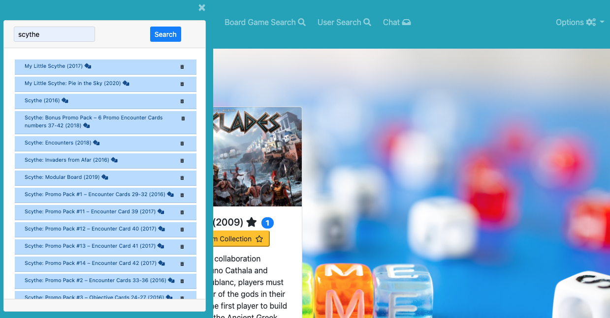
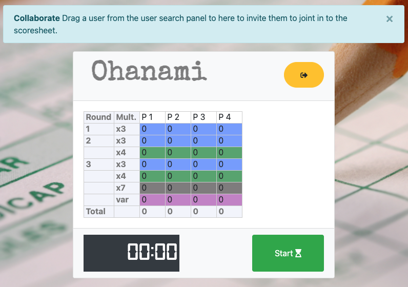

# Fitness Tracker     [](https://opensource.org/licenses/MIT)

# Table of Contents
- [Project Description](#project-description)
- [Installation Instructions](#installation-instructions)
- [Configuration Variables](#configuration-variables)
- [User Story](#user-story)
- [Screenshot](#screenshot)
- [How To Contribute](#how-to-contribute)
- [Technology](#technology)
- [Presentation](#presentation)
- [Questions](#questions)
- [License](#license)


# Project Description
This [web application](https://fitness-tracker-jps.herokuapp.com/) allows the user to register and start tracking their workouts.

The user is presented with:
1. A dashboard carousel showing their latest current workout and can scroll through and see their previous workouts.
2. Through the navigation, and buttons on their workouts, they can access all types of exercise (cardio/strength) created by any user;
3. Add their own named exercise, delete their own exercises, and edit the details on an exercise (distance and duration for cardio, sets/reps/weight and duration for strength based);
4. They can easily add exercises to the current active workout by:
    - clicking on the "transfer" button from the exercise type list;
    - dragging an exercise type to the current workout if open;
    - copying the exercises from a previous workout in the their dashboard in one easy click, or access the right click menu
5. View a graphical summary of their last seven workouts to track their progress.   

A logged in user also has access to:
1.  A user search function (by username) to find other users of the website
2.  The ability to create chat sessions with users, including group chats
3.  A user can leave a chat at any time
4.  A user can note some users as favourites, and will be notified if a user in their favourite list logs in/out
5.  A user can note some users as blocked, preventing those users from invite them to chat rooms and sending them messages

As a technical note, the chat sessions are persisted and offline messages are received on login.

If the user is idle, the session expires in 24 hours.

# Installation Instructions

1.  Install [node.js](http://nodejs.org)
2.  Using the installed Node Package Manager `npm`, execute `npm install`  in the `frontend` directory, and again in the `backend` directory.
3.  In the `frontend` directory, execute `npm run build.prod`, to build the webpacks for the backend `public/js` directory.
4.  In the `backend` directory, execute `npm run build`, to build the `.js` files from the Typescript, which are compiled to the `dist` directory.
5.  Configure the `.env` file with the specifics of your database, configuration files, and other parameters (message queue persistence, room timeouts):

# Configuration Variables

`API_SERVER_URL` - URL of the server completing the API calls (default `blank`)

`DB_URL` - address and access to the Mongo server machine 

`DEBUG` - activate debug output (sub-options are space separated names (e.g. `server socket db api route message-queue`)

`MODE` - `Production`

`MQ_FILE` - Location of the offline message queue storage file (default `./db/queue.json`)

`MQ_INTERVAL` - Milliseconds between queue persistence (default `10000` - 10 seconds)

`SM_EXPIRY_CHAT` - number of minutes to keep a chat room persisted with no activity (default `43200` - 30 days)

`SM_EXPIRY_SCORESHEET` - number of minutes to keep a score sheet room persisted with no activity (default `60`)

`VIEW_RELATIVE_PATH` - location of the handlebars files in production, should be set to `/../../`

# User Story

```
As a USER I want to be able to keep track of my workouts, and once logged into the site
THEN I can choose to view my previous workouts and/or add exercises to my new (current) workout
As a USER I want to be able to create exercises types that I will add/update/delete to/from workouts
THEN I want to be able to copy those exercises into the current workout via multiple easy to use means
As a USER I want to be able to review a 7 workout summary to track my progress, displayed graphically

As a USER I want to be able to find other users of the site
THEN I can save users as Favourites or, for privacy reasons, save a user to a Blocked
THEN I want to be notified if a Favourite user logins/out to the site
As a USER I want to be able to chat with another user, creating a chat conversation with that user
THEN I can close the chat room if I so choose
THEN I can also add another user, creating a group chat, by dragging them into the chat from the User Search
As a USER if I log off the site for a time, when I log back in, I want to receive any messages
FROM non-Blocked users when I log back in, with notifications telling me what I have waiting to review
```

# Screenshot



## How to contribute

Please access the [Questions](#questions) section to send me an email, or access the repository link if you wish to help contribute to this project.


# Technology

1. [Node.js](http://nodejs.org)
2. NPM
4. [Moment](https://npmjs.com/package/moment)
5. [React](https://www.npmjs.com/package/react)
6. [BCrypt](https://www.npmjs.com/package/bcrypt)
7. [Bootstrap](https://getbootstrap.com/)
8. [Webpack](https://www.typescriptlang.org/)
9. [Babel](https://babeljs.io/)
10. [MongoDB](https://www.mongodb.com/)
11. [Mongoose](https://mongoosejs.com/docs/)
12. [DotENV](https://www.npmjs.com/package/dotenv)
13. [Git-Crypt](https://github.com/AGWA/git-crypt)
14. [Express](https://www.npmjs.com/package/express)
15. [Passport](https://www.npmjs.com/package/passport)
16. [Socket.io](https://socket.io/)
17. [Typescript](https://www.typescriptlang.org/)
18. [ts-node](https://github.com/TypeStrong/ts-node)
19. [tsc-watch](https://www.npmjs.com/package/tsc-watch)
20. [ts-loader](https://github.com/TypeStrong/ts-loader)
21. [Chart.js](https://www.chartjs.org/)
22. [Bootstrap 4 Round Buttons](https://www.geeksforgeeks.org/how-to-get-circular-buttons-in-bootstrap-4/)


# Questions

>  **Direct your questions about this project to:**
>
>  *GitHub:* [Github Project Link](https://github.com/jsharples777/fitness-tracker)
>
>  *Email:* [jamie.sharples@gmail.com](mailto:jamie.sharples@gmail.com)

# License

### [MIT License](https://opensource.org/licenses/MIT)
A short and simple permissive license with conditions only requiring preservation of copyright and license notices. Licensed works, modifications, and larger works may be distributed under different terms and without source code.
