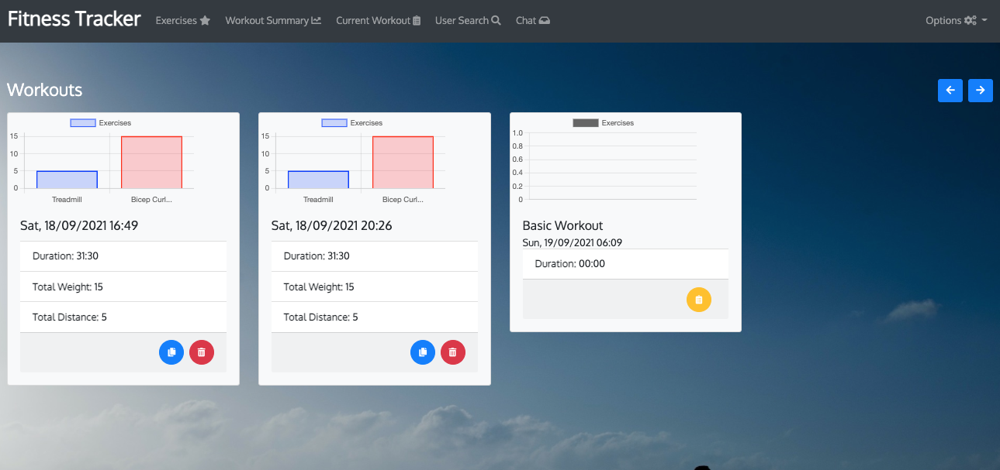

# I'm Board      [](https://opensource.org/licenses/MIT)

# Table of Contents
- [Project Description](#project-description)
- [Installation Instructions](#installation-instructions)
- [Configuration Variables](#configuration-variables)
- [User Story](#user-story)
- [Screenshot](#screenshot)
- [How To Contribute](#how-to-contribute)
- [Technology](#technology)
- [Presentation](#presentation)
- [Questions](#questions)
- [License](#license)


# Project Description
This [web application](https://im-board-beta.herokuapp.com/) allows the user to find board games from Board Game Geek and add them to a local collection.  From there they can manage that
collection adding and removing as they choose.  They can also start a score sheet for a board game, which is maintained in the browser and has some simple display and math functionality built-in.  
The user can run a timer on the scoresheet to track the game length and then save the score sheet for that board game and review them at a later date.

A new user can choose register and create a login with the Options menu, and then be able to manage their collections and scoresheets stored in a database.

A logged in user also has access to:
1.  A user search function (by username)
2.  The ability to create chat sessions with users, including group chats
3.  A user can leave a chat at any time
4.  A user can note some users as favourites, and will be notified if a user in their favourite list logs in/out
5.  A user can note some users as blocked, preventing those users from invite them to chat rooms and sending them messages

Finally a user can start a score sheet, and if logged in, and make it collaborative, inviting other logged in users and allow all invited users to enter data and share that data during the game, and if they
have the capability and a secure connection, join a video/audio chat session together.

As a technical note, the chat sessions are persisted and offline messages are received on login.

If the user is idle, the session expires in 24 hours.

# Installation Instructions

1.  Install [node.js](http://nodejs.org)
2.  Using the installed Node Package Manager `npm`, execute `npm install`  in the `frontend` directory, and again in the `backend` directory.
3.  In the `frontend` directory, execute `npm run build.prod`, to build the webpacks for the backend `public/js` directory.
4.  In the `backend` directory, execute `npm run build`, to build the `.js` files from the Typescript, which are compiled to the `dist` directory.
5.  Configure the `.env` file with the specifics of your database, configuration files, and other parameters (message queue persistence, room timeouts):

# Configuration Variables

`API_SERVER_URL` - URL of the server completing the API calls (default `blank`)

`DB_HOST` - address of the MySQL server machine

`DB_NAME` - the name of the database to use

`DB_USER` - the username to login to the database

`DB_PW` - the password of the database user

`DEBUG` - activate debug output (sub-options are space separated names (e.g. `server socket db api route message-queue`)

`MODE` - `Production`

`MQ_FILE` - Location of the offline message queue storage file (default `./db/queue.json`)

`MQ_INTERVAL` - Milliseconds between queue persistence (default `10000` - 10 seconds)

`QL_SCHEMA` - configuration file for the QL API (default `./config/schema.ql`)

`SM_EXPIRY_CHAT` - number of minutes to keep a chat room persisted with no activity (default `43200` - 30 days)

`SM_EXPIRY_SCORESHEET` - number of minutes to keep a score sheet room persisted with no activity (default `60`)

`URL_FindById` - URL for the BoardGameGeek.com XML2 API call for finding the details of a board game

`URL_Search` - URL for the BoardGameGeek.com XML2 API call to search for board games by name 

`VIEW_RELATIVE_PATH` - location of the handlebars files in production, should be set to `/../../`

# User Story

```
As a USER I want to be able to search for a board game by name, including partial matches
THEN I can choose to save the displayed board game details into the browser storage
As a USER I want to be able to create a score sheet for a board game in my collection
THEN I want to save the scoresheet, along with player names and scores and the date played, against the board game
As a USER I want to be able to review the scores for a given board game and delete those if I so choose

As a USER if I choose to register with the site
THEN previously browser stored board games and their scoresheets are loaded into my user account
As a USER I want to be able to find other users of the site
THEN I can save users as Favourites or, for privacy reasons, save a user to a Blocked
THEN I want to be notified if a Favourite user logins/out to the site
As a USER I want to be able to chat with another user, creating a chat conversation with that user
THEN I can close the chat room if I so choose
THEN I can also add another user, creating a group chat, by dragging them into the chat from the User Search
As a USER I want to be able to start a scoresheet for a boardgame and invite other users to join in
THEN the other users may accept/decline that invitation, and if accept, we can all modify the values on the scoresheet
WITH those values shown on each of our views, with a Start/Stop timer we can use to track game played time
As a USER if I receive an invitation to a scoresheet from a non-Blocked user, I want the option to decline
OR if I am already in a scoresheet, don't interrupt me
As a USER if I log off the site for a time, when I log back in, I want to receive any messages
FROM non-Blocked users when I log back in, with notifications telling me what I have waiting to review
```

# Screenshot



## How to contribute

Please access the [Questions](#questions) section to send me an email, or access the repository link if you wish to help contribute to this project.


# Technology

1. [Node.js](http://nodejs.org)
2. NPM
4. [Moment](https://npmjs.com/package/moment)
5. [React](https://www.npmjs.com/package/react)
6. [BCrypt](https://www.npmjs.com/package/bcrypt)
7. [Bootstrap](https://getbootstrap.com/)
8. [Webpack](https://www.typescriptlang.org/)
9. [Babel](https://babeljs.io/)
10. [MySQL](https://www.mysql.com/)
11. [MySQL2](https://www.npmjs.com/package/mysql2)
12. [DotENV](https://www.npmjs.com/package/dotenv)
13. [Git-Crypt](https://github.com/AGWA/git-crypt)
14. [Express](https://www.npmjs.com/package/express)
15. [Sequelize](https://www.npmjs.com/package/sequelize)
16. [Passport](https://www.npmjs.com/package/passport)
17. [Socket.io](https://socket.io/)
18. [Typescript](https://www.typescriptlang.org/)
19. [ts-node](https://github.com/TypeStrong/ts-node)
20. [tsc-watch](https://www.npmjs.com/package/tsc-watch)
21. [ts-loader](https://github.com/TypeStrong/ts-loader)
22. [GraphQL](https://graphql.org/)
23. [XML2js](https://www.npmjs.com/package/xml2js)
24. [Digital 7 Font](http://www.styleseven.com/)
25. [Bootstrap 4 Round Buttons](https://www.geeksforgeeks.org/how-to-get-circular-buttons-in-bootstrap-4/)
26. [Handsontable](https://handsontable.com/)
27. [WebRTC](https://developer.mozilla.org/en-US/docs/Web/API/WebRTC_API)
28. [Peerjs](https://peerjs.com/)
29. [Building a Video Chat App with Node.js + Socket.io + WebRTC](https://levelup.gitconnected.com/building-a-video-chat-app-with-node-js-socket-io-webrtc-26f46b213017)    

# Presentation

[Google presentation](https://docs.google.com/presentation/d/e/2PACX-1vSBaqdvg4ZTpuB6GpLoLwKwSM5dcWEug-tOjSjeoyPgw2haPdZ1pLZzSmdO53QJc7D8F3QuIThFIwqG/pub?start=false&loop=false&delayms=10000)

# Questions

>  **Direct your questions about this project to:**
>
>  *GitHub:* [Github Project Link](https://github.com/jsharples777/im-board)
>
>  *Email:* [jamie.sharples@gmail.com](mailto:jamie.sharples@gmail.com)

# License

### [MIT License](https://opensource.org/licenses/MIT)
A short and simple permissive license with conditions only requiring preservation of copyright and license notices. Licensed works, modifications, and larger works may be distributed under different terms and without source code.
